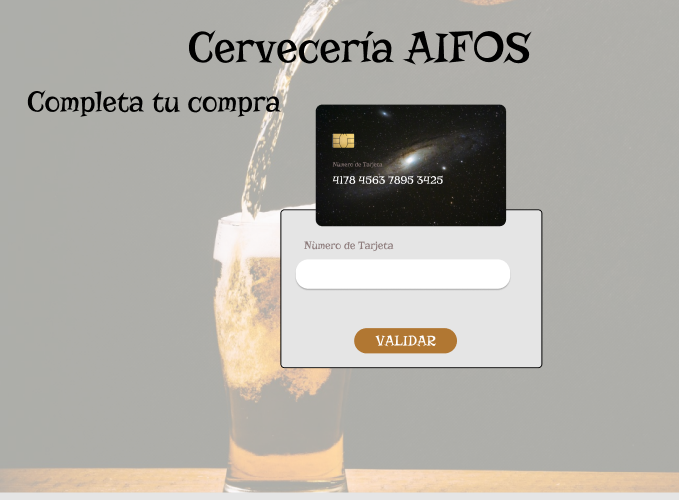
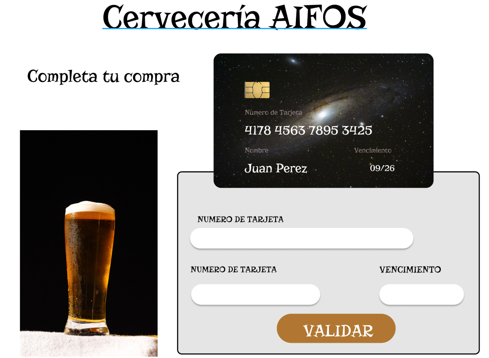
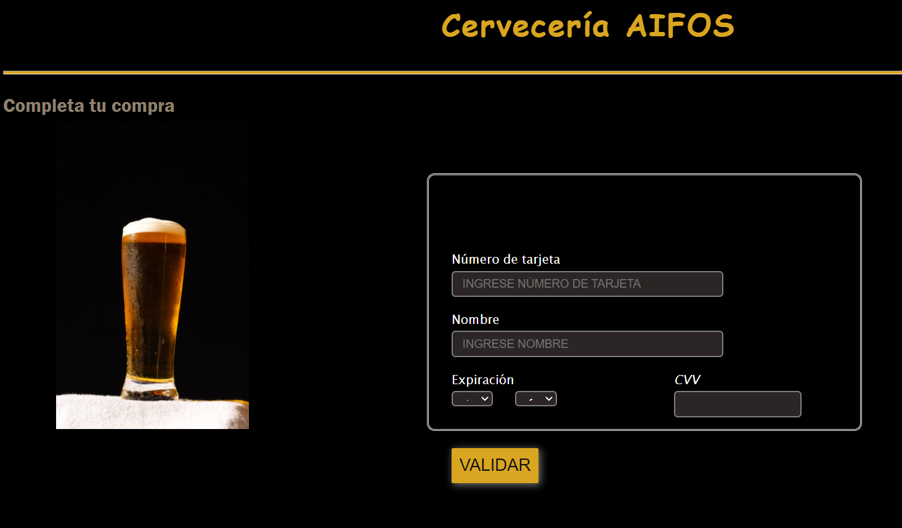

# Validación de Tarjeta

**Introducción**

La validación de tarjetas es importante para poder verificar la funcionalidad de una tarjeta de crédito o débito para poder comprobar si se puede confirmar la compra realizada a través de la pagina web.

## Definición del Cliente

Nuestro cliente es la empresa productora de cerveza artesanal "Cervecería AIFOS" quienes están iniciado sus ventas a través de su página web y necesitan tener la certeza de que las tarjetas ingresadas para completar la compra sean válidas y evitar
reprocesos.

 - **Objetivos del Cliente**
Nuestro cliente desea incrementar sus ventas a través de su pagina web de manera segura.

 - **Problema a solucionar**
Con este programa el cliente solucionará el problema de realizar una verificación de manera manual.

## Definición del Producto

 - **Usuarios**
Los usuarios serán las personas que desean adquirir los productos ofrecidos por la empresa.

 - **Objetivo del Usuario**
Realizar su compra de manera rápida y sencilla haciendo uso de su tarjeta de crédito o débito a través de la pagina web, sin tener que acercarse a una tienda o realizar pagos con efectivo.

## Primer Prototipo
Primer Prototipo realizado en figma: Se obtuvo feedback de mis compañeras quienes sugirieron incluir los datos como nombre, fecha de vencimiento y cvv.

Protitipo luego del feedback.

## Segundo Prototipo
Segundo Prototipo realizado en figma: Se obtuvo feedback del cliente quien desea una página mas seria con colores adecuados al rubro del negocio, deseó que la presentación sea en forma de tarjeta así pueda ser más facil para el usuario.

## Objetivos de aprendizaje

### HTML
- [ ] **Uso de HTML semántico**

### CSS
- [ ] **Uso de selectores de CSS**

### Web APIs
- [ ] **Uso de selectores del DOM**
- [ ] **Manejo de eventos del DOM (listeners, propagación, delegación)**
- [ ] **Manipulación dinámica del DOM**

### JavaScript

- [ ] **Variables (declaración, asignación, ámbito)**
- [ ] **Uso de condicionales (if-else, switch, operador ternario, lógica booleana)**
- [ ] **Uso de bucles/ciclos (while, for, for..of)**
- [ ] **Funciones (params, args, return)**
- [ ] **Pruebas unitarias (unit tests)**
- [ ] **Módulos de ECMAScript (ES Modules)**
- [ ] **Uso de linter (ESLINT)**
- [ ] **Uso de identificadores descriptivos (Nomenclatura y Semántica)**

### Control de Versiones (Git y GitHub)
- [ ] **Git: Instalación y configuración**
- [ ] **Git: Control de versiones con git (init, clone, add, commit, status, push, pull, remote)**
- [ ] **GitHub: Creación de cuenta y repos, configuración de llaves SSH**
- [ ] **GitHub: Despliegue con GitHub Pages**

### UX (User eXperience)
- [ ] **Diseñar la aplicación pensando en y entendiendo al usuario**
- [ ] **Crear prototipos para obtener feedback e iterar**
- [ ] **Aplicar los principios de diseño visual (contraste, alineación, jerarquía)**
